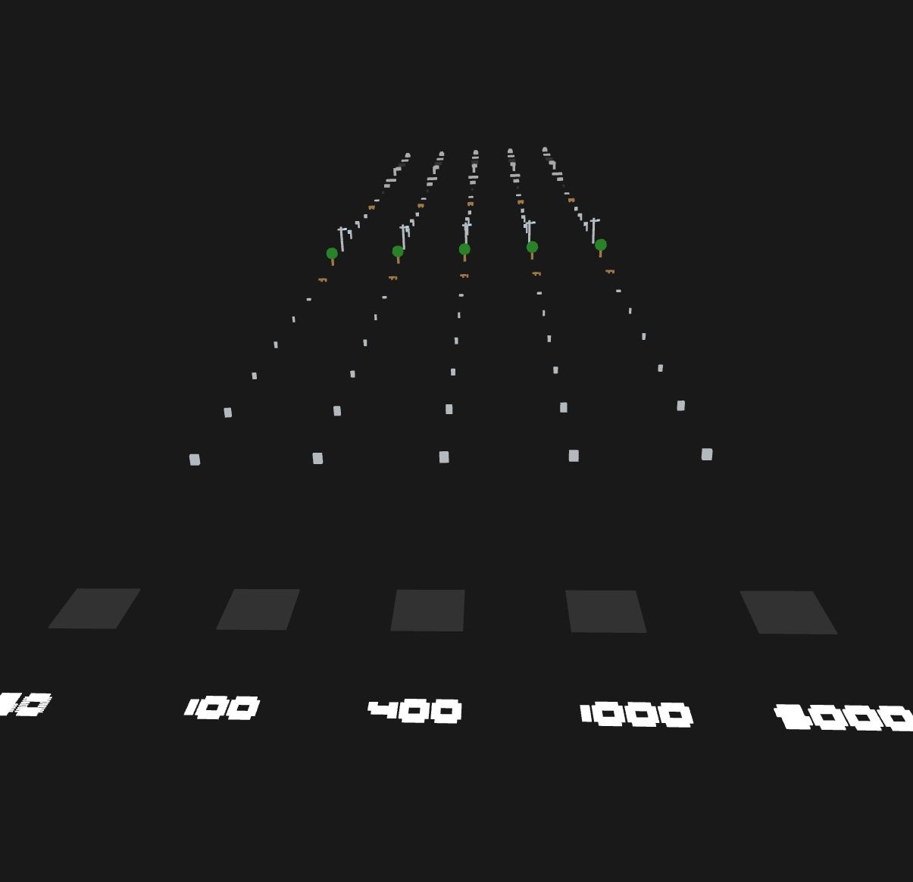

# Synthetic LAS Generation

A Python toolkit for generating synthetic LiDAR point cloud data in LAS/LAZ format. This project creates realistic 3D scenes with various urban infrastructure elements for testing, training, and development purposes.




## Features

### Core Generation System
- **30+ Pre-built Scenes**: Street patches, crosswalks, curbs, barriers, stairs, benches, power poles, manholes, sidewalks, and more
- **Realistic Materials**: Different intensity values and RGB colors for various materials (asphalt, concrete, metal, wood, vegetation, etc.)
- **ASPRS Classification**: Proper point classification codes following ASPRS standards
- **High Density**: ~400 points per square meter for realistic detail
- **Multiple Formats**: Export to both LAS and LAZ formats
- **3D Visualization**: Optional Open3D preview with RGB or intensity-based coloring
- **Batch Processing**: Generate individual scenes plus combined datasets

### Large-Scale Generation System
- **Professional Architecture**: Modular, production-ready codebase
- **Realistic Scene Composition**: Urban planning principles for realistic feature placement
- **Configurable Scenes**: Predefined configurations (residential, commercial, highway, park)
- **Custom Configurations**: JSON-based scene configuration system
- **Feature Selection**: Choose how many of each infrastructure element to include
- **Realistic Placement**: Crosswalks at intersections, trees along roads, utilities with proper spacing
- **Batch Generation**: Generate multiple scene variations efficiently
- **Comprehensive Metadata**: Detailed scene information and statistics

### Density Test Grid System
- **CAD-Focused Objects**: 24 specialized objects for drawing functionality testing
- **Multi-Density Testing**: 5 density levels (50, 100, 400, 1000, 5000 points/m²)
- **Clean Geometries**: Well-defined, individual objects without artifacts
- **Human-Readable Labels**: Numerical density labels for easy identification
- **Staircase Examples**: Perfect for testing drape tools and line drawing
- **Systematic Grid Layout**: Organized 24×5 grid for comprehensive testing
- **CAD Tool Testing**: Designed for area measurements, angle detection, elevation analysis

## Generated Scenes

The toolkit includes 30 distinct urban infrastructure scenes:

1. **Street Patch** - Basic asphalt road surface
2. **Crosswalk** - Road with white painted crosswalk markings
3. **Curb with Road** - Road section with concrete curb
4. **Jersey Barrier** - Concrete traffic barrier
5. **Stairs** - Concrete staircase
6. **Bench** - Wooden park bench
7. **Power Pole & Wires** - Utility pole with sagging power lines
8. **Manholes** - Metal utility access covers
9. **Barrier and Curb** - Combined barrier and curb section
10. **Sidewalk** - Concrete pedestrian walkway
11. **Parking Bumpers** - Concrete parking space markers
12. **Speed Hump** - Raised road surface
13. **Utility Cabinet** - Metal utility equipment box
14. **Phone Cabinet** - Telecommunications equipment
15. **Tree** - Vegetation with trunk and crown
16. **Furniture Boxes** - Various storage containers
17. **Driveway Crown** - Curved road surface
18. **Guardrail** - Metal safety barrier
19. **Bollards** - Vertical traffic posts
20. **Street Banked** - Angled road surface
21. **Stop Sign** - Traffic control sign
22. **Streetlight** - Road lighting fixture
23. **Fire Hydrant** - Emergency water access
24. **Mailbox Cluster** - Postal collection point
25. **Bike Rack** - Bicycle parking fixture
26. **Trash Can** - Waste receptacle
27. **Picnic Table** - Outdoor seating
28. **Median Island** - Road divider with curbs
29. **Pedestrian Ramp** - ADA-compliant ramp with tactile markings
30. **Storm Inlet Grate** - Drainage system access

## Installation

### Prerequisites

- Python 3.8 or higher
- pip package manager

### Setup Instructions

1. Clone this repository:
```bash
git clone https://github.com/Connor-Tluck/synthetic-las-generation.git
cd synthetic-las-generation
```

2. Create a virtual environment (recommended):
```bash
python -m venv venv
# On Windows:
venv\Scripts\activate
# On macOS/Linux:
source venv/bin/activate
```

3. Install dependencies:
```bash
pip install -r requirements.txt
```

### Alternative Installation

If you encounter issues with the requirements file, you can install packages individually:

```bash
pip install numpy>=1.21.0
pip install "laspy[lazrs]>=2.0.0"
pip install open3d>=0.15.0
```

### Troubleshooting

- **Windows users**: If you encounter issues with `laspy[lazrs]`, try installing without the extras first: `pip install laspy>=2.0.0`
- **macOS users**: You may need to install additional dependencies for Open3D: `brew install libomp`
- **Linux users**: Ensure you have the necessary system dependencies for Open3D

## Usage

### Quick Start - Large-Scale Generation

Generate realistic urban scenes with configurable features:

```bash
# Generate a residential street scene
python generate_large_scale_scenes.py --config residential_street

# Generate 5 commercial intersection scenes
python generate_large_scale_scenes.py --config commercial_intersection --count 5

# List available configurations
python generate_large_scale_scenes.py --list-configs
```

### Core Generation System

Generate all 30 individual scenes:

```bash
python generate_point_cloud_sandbox.py
```

This will create:
- Individual LAZ files for each scene (01_street_patch.laz, 02_crosswalk.laz, etc.)
- A combined file with all scenes (combined_sandbox.laz)
- A legend.json file with scene metadata
- Optional 3D preview window

### Density Test Grid

Generate a comprehensive test grid for CAD drawing functionality:

```bash
python generate_density_test_grid.py
```

This will create:
- A 24×5 grid of CAD-focused objects
- 5 density levels: 50, 100, 400, 1000, 5000 points/m²
- Human-readable numerical density labels
- Enhanced 3D preview with zoom controls
- Output: `density_test_grid_output/enhanced_density_test_grid.laz`

### Configuration Options

Edit the configuration section in `generate_point_cloud_sandbox.py`:

```python
WRITE_LAZ = True             # Set to False for LAS format
SHOW_PREVIEW = True         # Set to False to skip 3D preview
ADD_RGB = True               # Set to False for intensity-only data
```

### View Individual Scenes

Use the demo viewer to examine specific files:

```bash
python demo_scene.py path/to/your/file.laz
```

## Output Structure

### Core Generation System
```
pointcloud_sandbox_output/
├── 01_street_patch.laz
├── 02_crosswalk.laz
├── ...
├── 30_storm_inlet_grate.laz
├── combined_sandbox.laz
├── combined_sandbox.zip
└── legend.json
```

### Large-Scale Generation System
```
large_scale_output/
├── residential_street_001.laz
├── residential_street_001_metadata.json
├── commercial_intersection_001.laz
├── commercial_intersection_001_metadata.json
└── ...
```

### Density Test Grid System
```
density_test_grid_output/
├── enhanced_density_test_grid.laz
├── enhanced_grid_metadata.json
└── ...
```

## Point Cloud Properties

- **Density**: ~400 points per square meter
- **Format**: LAS 1.4 with point format 3
- **Coordinates**: Real-world scale (meters)
- **Classification**: ASPRS standard codes
- **Intensity**: 16-bit values (0-65535) based on material properties
- **Color**: 16-bit RGB values when enabled
- **Precision**: 1mm coordinate precision

## Material Properties

The system includes realistic material properties:

| Material | Intensity Range | Color | Use Case |
|----------|----------------|-------|----------|
| Asphalt | 8,000 ± 1,500 | Dark Gray | Roads, parking lots |
| Concrete | 18,000 ± 3,000 | Light Gray | Sidewalks, curbs |
| Metal | 30,000 ± 5,000 | Silver | Poles, barriers, utilities |
| Wood | 20,000 ± 4,000 | Brown | Benches, poles |
| Vegetation | 16,000 ± 3,000 | Green | Trees, landscaping |
| White Paint | 42,000 ± 4,000 | White | Markings, signs |
| Yellow Paint | 36,000 ± 3,500 | Yellow | Traffic markings |

## Classification Codes

Following ASPRS LAS specification:

- **1**: Unclassified
- **2**: Ground
- **3**: Low Vegetation
- **5**: High Vegetation
- **6**: Building
- **13**: Wire - Guard
- **14**: Wire - Conductor
- **17**: Bridge Deck
- **23**: Road Surface
- **24**: Curb
- **25**: Barrier
- **26**: Street Marking

## Applications

This synthetic data is ideal for:

- **Algorithm Testing**: LiDAR processing, classification, and analysis
- **Machine Learning**: Training data for point cloud segmentation and urban scene understanding
- **Software Development**: Testing LiDAR software without real data
- **Research**: Urban infrastructure analysis and modeling
- **Education**: Teaching LiDAR concepts and processing
- **Simulation**: Urban planning and infrastructure design
- **Data Augmentation**: Enhancing real LiDAR datasets with synthetic variations

## Technical Details

### Core Generation System
- **Grid-based Generation**: Systematic point placement with natural jitter
- **Material Simulation**: Realistic intensity and color values
- **Geometric Primitives**: Planes, boxes, cylinders, and custom shapes
- **Scene Composition**: Modular building blocks for complex scenes
- **Export Pipeline**: LAS/LAZ format with proper headers and metadata

### Large-Scale Generation System
- **Modular Architecture**: Separated concerns with SceneGenerator, SceneComposer, and ConfigurationManager
- **Realistic Placement**: Urban planning principles for feature positioning
- **Priority-based Composition**: Infrastructure placed before details for realistic scenes
- **Collision Avoidance**: Basic spatial conflict resolution
- **Metadata Generation**: Comprehensive scene statistics and configuration tracking
- **Batch Processing**: Efficient generation of multiple scene variations

## Dependencies

- **numpy** (≥1.21.0): Numerical computations and array operations
- **laspy[lazrs]** (≥2.0.0): LAS/LAZ file I/O with compression support
- **open3d** (≥0.15.0): 3D visualization and point cloud processing (optional)

### Optional Dependencies

- **matplotlib**: For additional plotting capabilities
- **scipy**: For advanced mathematical operations

## License

This project is open source. See the repository for license details.

## Contributing

Contributions are welcome! Please feel free to submit issues, feature requests, or pull requests.

## Large-Scale Generation System

The project includes a professional large-scale generation system for creating realistic urban environments:

### Key Features
- **Predefined Configurations**: Residential streets, commercial intersections, highways, urban parks
- **Custom Configurations**: JSON-based scene configuration system
- **Realistic Composition**: Features placed according to urban planning principles
- **Feature Selection**: Choose how many of each infrastructure element to include
- **Batch Generation**: Generate multiple scene variations efficiently

### Quick Examples
```bash
# Navigate to the large-scale generation folder
cd large_scale_generation

# Generate a residential street
python generate_large_scale_scenes.py --config residential_street

# Generate 5 commercial intersections
python generate_large_scale_scenes.py --config commercial_intersection --count 5

# Use custom configuration
python generate_large_scale_scenes.py --custom-config configs/my_scene.json
```

### Documentation
For detailed information about the large-scale generation system, see:
- [Large-Scale Generation Documentation](large_scale_generation/docs/LARGE_SCALE_GENERATION.md)
- [Sample Configuration](large_scale_generation/configs/sample_custom_scene.json)

## Project Structure

```
synthetic-las-generation/
├── generate_point_cloud_sandbox.py    # Core generation system
├── generate_density_test_grid.py      # Density test grid system
├── pointcloud_sandbox_output/         # Core system output
├── density_test_grid_output/          # Density test grid output
├── images/                            # Project images
│   ├── synthetic_las.jpg              # Main project image
│   └── density_grid.jpg               # Density test grid image
├── requirements.txt                   # Dependencies
├── README.md                          # This file
└── large_scale_generation/            # Large-scale generation system
    ├── generate_large_scale_scenes.py # Main large-scale interface
    ├── synthetic_scenes.py            # Scene generation module
    ├── scene_config.py                # Configuration management
    ├── scene_composer.py              # Scene composition engine
    ├── configs/                       # Configuration files
    │   ├── sample_custom_scene.json
    │   └── small_test_scene.json
    ├── docs/                          # Documentation
    │   └── LARGE_SCALE_GENERATION.md
    ├── README.md                      # Large-scale system docs
    └── large_scale_output/            # Large-scale system output
```

## Contact

For questions or support, please open an issue on GitHub.
