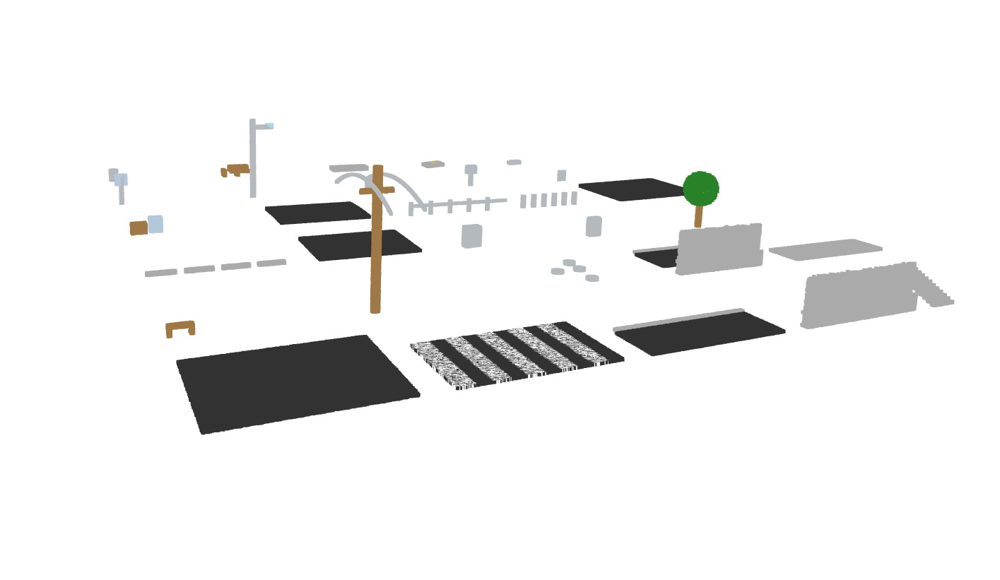

# Synthetic LAS Generation

A Python toolkit for generating synthetic LiDAR point cloud data in LAS/LAZ format. This project creates realistic 3D scenes with various urban infrastructure elements for testing, training, and development purposes.



## Features

- **30+ Pre-built Scenes**: Street patches, crosswalks, curbs, barriers, stairs, benches, power poles, manholes, sidewalks, and more
- **Realistic Materials**: Different intensity values and RGB colors for various materials (asphalt, concrete, metal, wood, vegetation, etc.)
- **ASPRS Classification**: Proper point classification codes following ASPRS standards
- **High Density**: ~400 points per square meter for realistic detail
- **Multiple Formats**: Export to both LAS and LAZ formats
- **3D Visualization**: Optional Open3D preview with RGB or intensity-based coloring
- **Batch Processing**: Generate individual scenes plus combined datasets

## Generated Scenes

The toolkit includes 30 distinct urban infrastructure scenes:

1. **Street Patch** - Basic asphalt road surface
2. **Crosswalk** - Road with white painted crosswalk markings
3. **Curb with Road** - Road section with concrete curb
4. **Jersey Barrier** - Concrete traffic barrier
5. **Stairs** - Concrete staircase
6. **Bench** - Wooden park bench
7. **Power Pole & Wires** - Utility pole with sagging power lines
8. **Manholes** - Metal utility access covers
9. **Barrier and Curb** - Combined barrier and curb section
10. **Sidewalk** - Concrete pedestrian walkway
11. **Parking Bumpers** - Concrete parking space markers
12. **Speed Hump** - Raised road surface
13. **Utility Cabinet** - Metal utility equipment box
14. **Phone Cabinet** - Telecommunications equipment
15. **Tree** - Vegetation with trunk and crown
16. **Furniture Boxes** - Various storage containers
17. **Driveway Crown** - Curved road surface
18. **Guardrail** - Metal safety barrier
19. **Bollards** - Vertical traffic posts
20. **Street Banked** - Angled road surface
21. **Stop Sign** - Traffic control sign
22. **Streetlight** - Road lighting fixture
23. **Fire Hydrant** - Emergency water access
24. **Mailbox Cluster** - Postal collection point
25. **Bike Rack** - Bicycle parking fixture
26. **Trash Can** - Waste receptacle
27. **Picnic Table** - Outdoor seating
28. **Median Island** - Road divider with curbs
29. **Pedestrian Ramp** - ADA-compliant ramp with tactile markings
30. **Storm Inlet Grate** - Drainage system access

## Installation

1. Clone this repository:
```bash
git clone https://github.com/Connor-Tluck/synthetic-las-generation.git
cd synthetic-las-generation
```

2. Install dependencies:
```bash
pip install -r requirements.txt
```

## Usage

### Generate All Scenes

Run the main script to generate all 30 scenes:

```bash
python generate_point_cloud_sandbox.py
```

This will create:
- Individual LAZ files for each scene (01_street_patch.laz, 02_crosswalk.laz, etc.)
- A combined file with all scenes (combined_sandbox.laz)
- A legend.json file with scene metadata
- Optional 3D preview window

### Configuration Options

Edit the configuration section in `generate_point_cloud_sandbox.py`:

```python
WRITE_LAZ = True             # Set to False for LAS format
SHOW_PREVIEW = True         # Set to False to skip 3D preview
ADD_RGB = True               # Set to False for intensity-only data
```

### View Individual Scenes

Use the demo viewer to examine specific files:

```bash
python demo_scene.py path/to/your/file.laz
```

## Output Structure

```
pointcloud_sandbox_output/
├── 01_street_patch.laz
├── 02_crosswalk.laz
├── ...
├── 30_storm_inlet_grate.laz
├── combined_sandbox.laz
├── combined_sandbox.zip
└── legend.json
```

## Point Cloud Properties

- **Density**: ~400 points per square meter
- **Format**: LAS 1.4 with point format 3
- **Coordinates**: Real-world scale (meters)
- **Classification**: ASPRS standard codes
- **Intensity**: 16-bit values (0-65535) based on material properties
- **Color**: 16-bit RGB values when enabled
- **Precision**: 1mm coordinate precision

## Material Properties

The system includes realistic material properties:

| Material | Intensity Range | Color | Use Case |
|----------|----------------|-------|----------|
| Asphalt | 8,000 ± 1,500 | Dark Gray | Roads, parking lots |
| Concrete | 18,000 ± 3,000 | Light Gray | Sidewalks, curbs |
| Metal | 30,000 ± 5,000 | Silver | Poles, barriers, utilities |
| Wood | 20,000 ± 4,000 | Brown | Benches, poles |
| Vegetation | 16,000 ± 3,000 | Green | Trees, landscaping |
| White Paint | 42,000 ± 4,000 | White | Markings, signs |
| Yellow Paint | 36,000 ± 3,500 | Yellow | Traffic markings |

## Classification Codes

Following ASPRS LAS specification:

- **1**: Unclassified
- **2**: Ground
- **3**: Low Vegetation
- **5**: High Vegetation
- **6**: Building
- **13**: Wire - Guard
- **14**: Wire - Conductor
- **17**: Bridge Deck
- **23**: Road Surface
- **24**: Curb
- **25**: Barrier
- **26**: Street Marking

## Applications

This synthetic data is ideal for:

- **Algorithm Testing**: LiDAR processing, classification, and analysis
- **Machine Learning**: Training data for point cloud segmentation
- **Software Development**: Testing LiDAR software without real data
- **Research**: Urban infrastructure analysis and modeling
- **Education**: Teaching LiDAR concepts and processing

## Technical Details

- **Grid-based Generation**: Systematic point placement with natural jitter
- **Material Simulation**: Realistic intensity and color values
- **Geometric Primitives**: Planes, boxes, cylinders, and custom shapes
- **Scene Composition**: Modular building blocks for complex scenes
- **Export Pipeline**: LAS/LAZ format with proper headers and metadata

## Dependencies

- **numpy**: Numerical computations
- **laspy[lazrs]**: LAS/LAZ file I/O
- **open3d**: 3D visualization (optional)

## License

This project is open source. See the repository for license details.

## Contributing

Contributions are welcome! Please feel free to submit issues, feature requests, or pull requests.

## Contact

For questions or support, please open an issue on GitHub.
