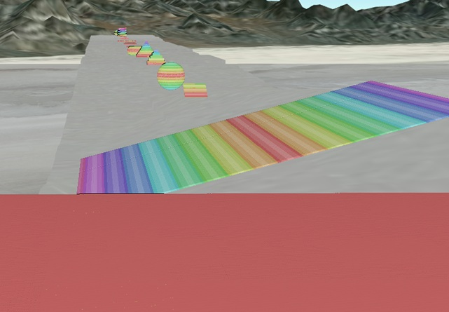

# Synthetic LAS Generation

A Python toolkit for generating synthetic LiDAR point cloud data in LAS/LAZ format. This project creates realistic 3D scenes with various urban infrastructure elements for testing, training, and development purposes.


*Density Test Grid showing 24 different objects across 5 density levels (10, 50, 200, 1000, 5000 points/m²). Each column demonstrates how different point cloud densities affect the visual appearance and detail level of the same objects, making it perfect for testing CAD tools and algorithms across various data densities.*



*Geometric Shapes Test showcasing 14 different 3D geometric primitives including spheres, cones, torus, helix, stepped pyramids, geodesic domes, and more. Each shape is generated with 5000 points/m² density and demonstrates the system's capability to create complex geometric forms for testing point cloud processing algorithms, 3D reconstruction, and geometric analysis applications.*

## Features

- **30+ Pre-built Scenes**: Street patches, crosswalks, curbs, barriers, stairs, benches, power poles, manholes, sidewalks, and more
- **Realistic Materials**: Different intensity values and RGB colors for various materials (asphalt, concrete, metal, wood, vegetation, etc.)
- **ASPRS Classification**: Proper point classification codes following ASPRS standards
- **High Density**: ~400 points per square meter for realistic detail
- **Multiple Formats**: Export to both LAS and LAZ formats
- **3D Visualization**: Optional Open3D preview with RGB or intensity-based coloring
- **Density Test Grid**: 24 CAD-focused objects across 5 density levels for testing
- **Geometric Shapes**: 14 different 3D geometric primitives for algorithm testing

## Installation

### Prerequisites
- Python 3.8 or higher
- pip package manager

### Setup Instructions

1. Clone this repository:
```bash
git clone https://github.com/Connor-Tluck/synthetic-las-generation.git
cd synthetic-las-generation
```

2. Create a virtual environment (recommended):
```bash
python -m venv venv
# On Windows:
venv\Scripts\activate
# On macOS/Linux:
source venv/bin/activate
```

3. Install dependencies:
```bash
pip install -r requirements.txt
```

## Usage

### Core Generation System

Generate all 30 individual scenes:

```bash
python generators/generate_point_cloud_sandbox.py
```

This will create:
- Individual LAZ files for each scene (01_street_patch.laz, 02_crosswalk.laz, etc.)
- A combined file with all scenes (combined_sandbox.laz)
- A legend.json file with scene metadata
- Optional 3D preview window

### Density Test Grid

Generate a comprehensive test grid for CAD drawing functionality:

```bash
python generators/generate_density_test_grid.py
```

This will create:
- A 24×5 grid of CAD-focused objects
- 5 density levels: 50, 100, 400, 1000, 5000 points/m²
- Human-readable numerical density labels
- Enhanced 3D preview with zoom controls

### Geometric Shapes Test

Generate 14 different 3D geometric primitives for algorithm testing:

```bash
python generators/generate_geometric_shapes_test.py
```

This will create:
- 14 individual geometric shape files (sphere, cone, torus, helix, etc.)
- High-density point clouds (5000 points/m²) for detailed analysis
- Clean mathematical forms perfect for algorithm testing

### Large-Scale Generation System

**Work in Progress** - Advanced scene generation system for creating realistic urban environments.

## Digital Surveyor Integration


*Digital Surveyor Integration showing the upload process for synthetic LiDAR data to the platform.*

Upload your generated synthetic data to Digital Surveyor for visualization and analysis:

1. **Generate your data** using any of the generation scripts
2. **Compress the files** (if needed) to reduce upload size
3. **Upload as .las format** to the Digital Surveyor platform
4. **View your data** - The platform will load your synthetic data near the Salt Flats origin for easy access and visualization

This integration allows you to:
- Visualize your synthetic point clouds in a professional web-based viewer
- Share your generated data with team members
- Analyze and compare different synthetic datasets
- Use the platform's tools for point cloud processing and analysis

## Output Structure

```
outputs/
├── pointcloud_sandbox_output/         # Core system output
├── density_test_grid_output/          # Density test grid output
└── geometric_shapes_output/           # Geometric shapes output

generators/
├── generate_point_cloud_sandbox.py    # Core generation system
├── generate_density_test_grid.py      # Density test grid system
├── generate_geometric_shapes_test.py  # Geometric shapes system
└── bonus_stuff/                       # Fun examples (Hollywood sign, moon landing)
```

## Applications

This synthetic data is ideal for:

- **Algorithm Testing**: LiDAR processing, classification, and analysis
- **Machine Learning**: Training data for point cloud segmentation and urban scene understanding
- **Software Development**: Testing LiDAR software without real data
- **Research**: Urban infrastructure analysis and modeling
- **Education**: Teaching LiDAR concepts and processing
- **Geometric Analysis**: Testing 3D reconstruction, shape recognition, and geometric algorithms
- **Computer Vision**: Training and testing point cloud processing algorithms

## Dependencies

- **numpy** (≥1.21.0): Numerical computations and array operations
- **laspy[lazrs]** (≥2.0.0): LAS/LAZ file I/O with compression support
- **open3d** (≥0.15.0): 3D visualization and point cloud processing (optional)

## License

This project is open source. See the repository for license details.

## Contributing

Contributions are welcome! Please feel free to submit issues, feature requests, or pull requests.

## Contact

For questions or support, please open an issue on GitHub.